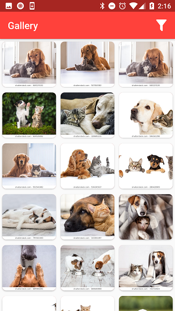
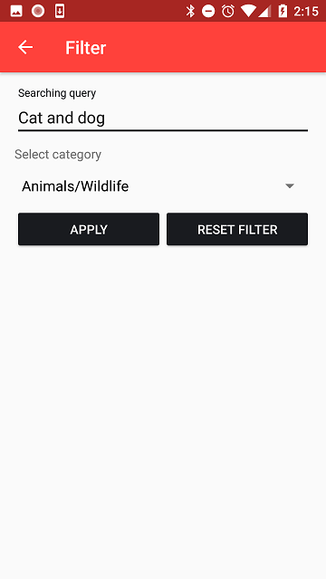

# ShutterStockGallery
Develop an application that is a gallery of photos of the service ShutterStock

Main technologies: **Kotlin, MVP, RxJava, Retrofit, DBFlow**

The application consists of 3 main screens.

1) **Splash Activity** - activity for solving the problem of blank white page at the start of the app and loading list of categories during the first run. Categories are stored in a database table, which allows you to quickly access them.

2) **Gallery Activity** - a screen containing a progressively downloadable list of photos

3) **Filter Activity** - a screen on which you can select a category of images or enter a search phrase

Of the features of the implementation should note the use of **basic authentication**. ShutterStock Api support 2 ways of auth: Basic and OAuth2. The second option is used for user login and access to personal settings, photos and data. Since the functionality of the application does not imply working with the user's personal data, it was decided to implement only the first option.

Also you can see different key pairs for different build versions. The reason for having two **client key pairs** (debug and release version) is the availability of an analytics engine integrated in ShutterStock service. The main idea is do not mix analytics data for two versions. However, it should be noted that for the release version no signatures have been added. When trying to build the app an Android Studio will require to input of the necessary data.

I have to note the fact that the processing of clicking on the image was not added. I expected to realize the opening of the full version of the image with the help of a new fragment or activaty. However, the listener of this event was embedded in the adapter code.
